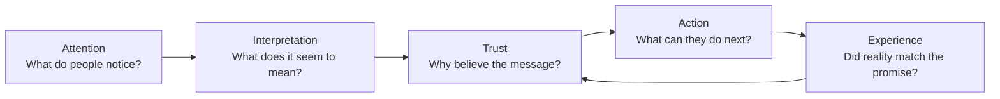

# Chapter 1: Persuasion Is About Meaning, Not Magic

Persuasion is the practice of helping people notice something, make sense of it, decide whether to trust it, and choose what to do next. It appears in advertisements, public-health posters, product pages, classroom presentations, and a friend asking you to try a new restaurant.

It is not a superpower that makes people do things against their will. Good persuasion gives people relevant reasons and makes a choice easier to understand. The person being persuaded still has agency: they can say yes, no, or not yet.

Consider a plain white T-shirt. Its cotton, stitching, color, and fit may stay exactly the same. Yet these descriptions shape what people pay attention to:

- **Basic:** “Plain white T-shirt. $12.”
- **Practical:** “A soft, easy-to-layer white T-shirt for everyday wear.”
- **Durability-focused:** “A heavyweight white T-shirt made for repeated washing.”
- **Identity-focused:** “The clean white tee for people building a simple wardrobe.”

None of these sentences changes the shirt itself. They frame the same object as cheap, useful, durable, or connected to an identity. Framing can be helpful when it reveals a real benefit. It becomes dishonest when it suggests benefits the product cannot deliver.

## Persuasion, coercion, and manipulation

The difference is less about whether someone changes their mind and more about how that change is sought.

| Approach | How it works | What happens to the audience's choice? | White T-shirt example |
| --- | --- | --- | --- |
| Persuasion | Offers understandable, relevant reasons and a clear choice | The person can evaluate the claim and decline | “This heavier cotton shirt may last longer if you wear white tees often.” |
| Manipulation | Hides important information or exploits confusion, fear, or pressure | Choice is technically available but unfairly distorted | Showing “Only 1 left!” when stock is not actually limited |
| Coercion | Uses a threat, force, or serious penalty | Meaningful choice is removed | “Buy this shirt or lose access to an essential service.” |

Persuasion can be energetic, emotional, and memorable without being manipulative. The ethical test is whether the audience would still consider the message fair if they understood how it was designed.

## What persuasion shapes

Persuasion often works through a sequence rather than a single dramatic moment.

For the T-shirt, a clear product photo may earn attention. “Heavyweight cotton” gives the viewer an interpretation. Accurate sizing details and honest reviews can support trust. A visible size selector makes action easy. After delivery, the actual quality either strengthens or damages future trust.

## Cialdini's principles of influence

Psychologist Robert Cialdini described several recurring influence principles. They are not buttons to press on people. They are patterns that can explain why a message feels more convincing. Use them to communicate real value, not to manufacture pressure.

| Principle | Basic idea | Ethical T-shirt use | Ethical limit |
| --- | --- | --- | --- |
| Reciprocity | People often want to return a genuine benefit | Offer a useful fabric-care guide before asking for an email signup | Do not make a “free” gift secretly dependent on a purchase |
| Commitment and consistency | People often prefer actions that fit earlier choices and stated values | Let someone save a “simple wardrobe” list, then show compatible basics | Do not trap a small signup into unwanted recurring charges |
| Social proof | When uncertain, people look to what similar others do | Show verified reviews that explain fit or wash results | Do not invent reviews or hide a representative pattern of complaints |
| Authority | Expertise can make a claim more credible | Explain a textile expert's real testing method and qualifications | Do not use vague labels such as “expert approved” with no basis |
| Liking | We are more open to people or groups we like or relate to | Use welcoming language and models who genuinely represent the intended community | Do not pretend a paid spokesperson is an ordinary customer |
| Scarcity | Limited availability can increase perceived value | State a real limited run or a genuine size shortage | Do not create fake countdowns or false inventory warnings |
| Unity | Shared identity can increase cooperation and trust | Invite members of a campus club to a shirt designed for their real event | Do not imply that belonging requires buying |

The last principle, unity, concerns a meaningful shared “we”: family, team, neighborhood, or community. It is stronger than simply being liked because it connects a message to a group identity.

## Two more ideas that make persuasion easier to understand

### 1. Framing changes the question

People do not respond to facts in a vacuum. A frame selects which part of a situation feels most important. “$12 for a shirt” invites a price question. “One dependable layering shirt” invites a usefulness question. “Heavyweight cotton for repeated washing” invites a durability question.

Framing should not erase the tradeoff. If the heavyweight shirt is warmer or costs more than a thin alternative, say so. A fair frame helps someone choose based on the value they actually care about.

### 2. Cognitive ease and choice design

People have limited time and attention. Clear headings, readable sizes, plain language, and a short checkout process reduce unnecessary mental effort. This is sometimes called designing for cognitive ease. It does not mean making choices mindless; it means removing friction that has nothing to do with the decision.

For example, a T-shirt page could show:

- fabric weight and care instructions near the product description;
- a size chart with the model's height and worn size;
- the total price before checkout; and
- a clear return policy.

Those details help a buyer decide. Hiding shipping fees until the final screen may increase a short-term conversion number, but it weakens trust.

### 3. The audience may think quickly or carefully

Sometimes people decide quickly using simple cues: a familiar brand, an attractive image, or “most popular.” Other times they examine evidence: material details, price comparisons, reviews, and return policies. This distinction is often described in persuasion research as different routes of processing.

A responsible designer supports both. A product image and brief headline can serve the hurried shopper, while accurate specifications serve the careful shopper. The quick route should never be used to conceal what the careful route would reveal.

## Ethical cautions

Persuasion becomes risky when a design makes people less able to notice, understand, or freely act. Be especially cautious with audiences who may have less power, less information, limited time, or heightened vulnerability.

- Do not use false scarcity, fake testimonials, hidden fees, or confusing cancellation paths.
- Do not make a claim stronger than the evidence supports.
- Make important conditions visible, especially price, privacy choices, recurring costs, and risks.
- Respect a “no.” A refusal should not trigger shame, repeated pressure, or a harder path to leave.
- Check whether the message could cause unequal harm to different groups.

The goal is not merely to get someone to click “buy.” It is to create an informed action that the person is unlikely to regret because the design hid something important.

## Questions a designer should ask

Before trying to persuade someone, pause and ask:

1. What real problem, goal, or value does this message address?
2. What am I asking the person to notice, believe, or do?
3. Which facts would a reasonable person need before deciding?
4. Is the framing accurate for the actual product or service?
5. Would the message still feel fair if the audience knew the persuasive technique being used?
6. Does the design leave an easy, dignified way to decline or change course?
7. Who might be harmed, excluded, or pressured by this message?
8. After acting, will the person's experience match the promise?

## Explore Further

If you want to research these ideas, try searches such as:

- `Robert Cialdini principles of influence reciprocity social proof authority`
- `framing effect psychology examples`
- `cognitive ease choice architecture behavioral economics`
- `central peripheral route persuasion communication`
- `ethical persuasion dark patterns design`

## What You Should Remember

Persuasion shapes attention, interpretation, trust, and action; it should not remove a person's meaningful choice. The same plain white T-shirt can be framed around price, practicality, durability, or identity without changing the shirt. Principles such as reciprocity, social proof, authority, scarcity, and unity can clarify why messages work, but ethical design requires truthful claims, visible tradeoffs, and an easy way to say no.
