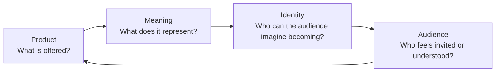

# Chapter 2: Brand Archetypes Give Products Meaning

A brand archetype is a familiar cultural or narrative pattern that helps an audience quickly understand what a product, organization, or experience stands for. It gives people a useful answer to a question that product features alone cannot answer: *Why might this matter to me?*

For example, a plain white T-shirt has physical features: fabric, cut, price, size, and care instructions. An archetype can add a layer of meaning. It can make the same shirt feel like a tool for independence, a dependable everyday essential, or a creative blank canvas.

Archetypes are not rigid categories of human personality. They are generalized patterns found in stories, symbols, and cultural expectations. A person can be curious in one situation, caring in another, and rebellious in another. Brands can also combine tendencies. A community clinic might mainly communicate Caregiver values while also using Sage qualities to explain health information clearly.

Culture matters too. A symbol, joke, color, or idea of success can carry different meanings in different places and communities. Before using an archetype, learn from the audience instead of assuming one story will fit everyone.

## From product to audience identity

An archetype connects a real offering to a possible identity. It should be supported by the actual product and experience, not just an exciting slogan.

For a white T-shirt, a durable fabric and clear care instructions are product facts. Calling it a dependable daily uniform creates meaning. The buyer may then imagine themselves as someone with a simple, capable wardrobe. That identity may appeal to an audience that wants fewer decisions in the morning.

The practical question is:

> **What does the audience get to feel, imagine, or become by choosing this brand?**

This question moves beyond “What are we selling?” toward “What role can this honestly play in someone’s life?”

## Common brand archetypes

The following set is a useful starting point, not a complete rulebook. A brand does not need to choose an archetype forever, and it should not claim a meaning its actions cannot support.

| Archetype | Core promise or feeling | What the audience may imagine | White T-shirt direction |
| --- | --- | --- | --- |
| Explorer | Freedom, discovery, self-direction | “I can go my own way.” | A packable tee for spontaneous weekends and unfamiliar places |
| Sage | Understanding, truth, thoughtful choice | “I can choose with knowledge.” | A shirt explained with plain fabric, fit, and care details |
| Creator | Expression, originality, making | “I can make this my own.” | A blank tee presented as a surface for drawing, printing, or styling |
| Ruler | Control, standards, accomplishment | “I am prepared and in charge.” | A crisp, structured tee for a polished, intentional wardrobe |
| Caregiver | Support, protection, generosity | “I can care for myself and others.” | A soft, comfortable tee designed around ease and practical care |
| Rebel | Independence, disruption, refusing limits | “I do not have to follow the expected script.” | A stark tee paired with bold, unconventional styling |
| Hero | Courage, effort, achievement | “I can meet a challenge.” | A hard-wearing tee positioned for training, work, or demanding days |
| Everyperson | Belonging, reliability, everyday connection | “This is for people like me.” | An affordable, easy-to-wear tee for ordinary daily routines |
| Innocent | Simplicity, optimism, trust | “Life can feel clear and uncomplicated.” | A clean, bright tee presented with calm, straightforward language |
| Jester | Play, surprise, enjoyment | “I can lighten up.” | A basic white tee styled with funny accessories or a playful campaign |
| Lover | Connection, beauty, sensory pleasure | “I can feel confident and close to others.” | A soft, flattering tee shown as part of a personal, expressive outfit |
| Magician | Transformation, possibility, wonder | “A small change can reshape how I feel.” | A tee framed as the first piece in a wardrobe transformation |

The table describes possible directions, not facts about any real company. The details of the shirt still matter. A brand cannot responsibly call a rough, poorly fitted shirt “comforting” just because it uses Caregiver language.

## One shirt, three very different meanings

Imagine three sellers offering the exact same plain white T-shirt at the same price. The shirt itself does not change. The meaning around it does.

### 1. Explorer: “Ready to leave the plan behind”

The Explorer version shows the T-shirt rolled into a weekend bag beside a map, water bottle, and worn sneakers. Its message emphasizes light packing, movement, and choosing the unfamiliar route.

- **Audience gets to feel:** independent and ready.
- **Audience gets to imagine:** an unplanned day trip or a new neighborhood.
- **Audience gets to become:** someone who acts on curiosity.

The product description must remain accurate. If the shirt is not especially lightweight or travel-friendly, the campaign can still use an adventurous mood, but it should not make false performance claims.

### 2. Everyperson: “The shirt that fits real life”

The Everyperson version shows people doing everyday activities such as commuting, studying, cooking, or meeting friends. Its language is welcoming and practical: a simple white tee that works with the clothes people already own.

- **Audience gets to feel:** included and at ease.
- **Audience gets to imagine:** an uncomplicated, familiar routine.
- **Audience gets to become:** someone who belongs without needing to perform status.

This direction works best when the buying experience is genuinely accessible: clear sizing, understandable prices, and images that do not suggest only one kind of person belongs.

### 3. Creator: “Start with a blank canvas”

The Creator version treats the plain surface as an invitation. It might show the T-shirt being customized with fabric paint, layered under a jacket, or used as the base of several outfits. The focus is not on the shirt being extraordinary by itself; it is on what the wearer can do with it.

- **Audience gets to feel:** inventive and expressive.
- **Audience gets to imagine:** an outfit or design that no one else has made.
- **Audience gets to become:** an active maker rather than a passive buyer.

Here, a useful concrete addition could be a short guide to fabric-safe customization. That practical help makes the Creator promise more believable.

## Archetypes can work together

Many strong brands use a primary archetype with one or two supporting tendencies. For instance, a local workshop could combine Creator and Everyperson: “Make something personal, and everyone is welcome to try.” A public library could combine Sage and Caregiver by offering trustworthy information in a patient, supportive environment.

Combining archetypes should make the message clearer, not vague. “Bold, luxurious, playful, serious, rebellious, and calm” gives an audience too many conflicting signals. Choose the most important feeling first, then use a supporting archetype only when it helps explain the experience.

## Archetypes Are Not Destiny

An archetype is a communication choice, not a permanent label. People change, organizations change, and audiences may need different things at different times. A brand that usually acts like a Sage can use a little Jester humor in a social post without losing its core meaning. A person who enjoys an Explorer campaign is not required to be adventurous all the time.

Avoid using archetypes to stereotype customers. Do not assume that age, gender, neighborhood, culture, or job determines what someone values. Test ideas with real audience feedback, make room for disagreement, and revise when the story does not match people’s lived experience.

Most importantly, meaning has to meet reality. If a brand promises courage, care, creativity, or transformation, its product quality, customer support, and decisions should give people evidence for that promise.

## Questions to Ask When Choosing an Archetype

1. What real need, hope, or value does the product or experience support?
2. What does the audience get to feel, imagine, or become by choosing it?
3. Which archetype makes that answer clearest?
4. What product facts, service choices, or design details support the message?
5. Could the message exclude, stereotype, or misread part of the audience?
6. Does this meaning make sense in the cultural setting where the brand will appear?
7. Are we using one clear primary direction, or mixing so many that the message becomes confusing?
8. Would a customer’s real experience match the identity we are inviting them to imagine?

## Explore Further

If you want to research these ideas, try searches such as:

- `brand archetypes cultural context marketing`
- `archetypes narrative patterns brand strategy`
- `audience research inclusive brand positioning`
- `product positioning meaning identity marketing`

## What You Should Remember

Brand archetypes are flexible cultural and narrative patterns that help audiences recognize meaning; they are not fixed personality types. A product’s features stay important, but archetypes help answer what someone can feel, imagine, or become by choosing it. The same plain white T-shirt can honestly signal Explorer independence, Everyperson belonging, or Creator expression when the message is supported by the product and experience. Choose a clear direction, respect cultural context, avoid stereotypes, and let real customer experience prove the promise.
