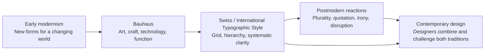

# Chapter 3: Design Language Carries Ideas

Visual design does more than make information look attractive. Choices about type, color, spacing, images, and layout suggest what an organization values and how it expects people to behave. A crowded page can feel energetic, urgent, or difficult. A page with generous space and a strict grid can feel calm, organized, and authoritative.

This collection of visual choices is often called a **design language**. Like a spoken language, it gives an audience clues before they read every word. Learning to notice those clues helps you design deliberately instead of copying a style because it looks fashionable.

## A short path from modernism to postmodernism

Early modernism developed as artists, architects, and designers responded to industrial production, new technologies, and rapidly changing cities in the late nineteenth and early twentieth centuries. Many wanted visual forms that suited the present rather than repeating historical decoration. Different modernist movements had different goals, but a common interest was finding new, purposeful ways to organize material, space, and information.

The **Bauhaus**, a German school active from 1919 to 1933, connected art, craft, design, and technology. Its teaching and work helped make ideas such as geometric form, functional construction, and the relationship between materials and use especially influential. “Function” did not mean that objects had to be dull; it meant that a design should take its purpose seriously.

Later, the **Swiss / International Typographic Style** developed strongly in the mid-twentieth century. Designers associated with this approach often used asymmetric layouts, sans-serif type, photography, consistent systems, and grids. The goal was clear communication that could work across audiences. A grid is an underlying structure of columns, rows, and alignment points. It helps a reader predict where to look and helps a team make many pages feel related.

Modernism was never one identical style, and not every modernist designer agreed. Still, it is useful to recognize a cluster of modernist priorities: reduction, hierarchy, clarity, function, order, and a hope that visual systems could communicate broadly.

From the 1960s onward, many designers and critics questioned the idea that a single clean, universal visual language was neutral or sufficient. **Postmodernism** partly reacted against modernist certainty, restraint, universality, and order. It made room for plurality, local identity, historical reference, quotation, irony, layered images, and expressive typography. A postmodern design may intentionally interrupt a grid, mix visual voices, or make the audience aware that design is making an argument.

That reaction was not a simple replacement. Contemporary design still uses both approaches. A banking app may rely on modernist clarity for account balances while using expressive illustrations to make its voice less intimidating. A music site may use an orderly navigation system with deliberately disruptive type in its promotional area. History did not end with one winning style; the tension remains useful.

## A continuing set of tensions

It is tempting to label modernism “good design” and postmodernism “rule-breaking design,” or the reverse. That shortcut misses the point. These are useful tensions that can help a designer choose a fitting visual language for a particular audience, task, and context.

| Design tension | One possible direction | The other possible direction | Contemporary web or product example |
| --- | --- | --- | --- |
| Order and disruption | Repeated alignment and predictable navigation | Deliberate overlap, interruption, or surprise | A course site uses a stable menu, while an event page interrupts it with animated announcements. |
| Universality and identity | Shared conventions meant to be broadly legible | References to a specific community, place, or point of view | A transit app uses familiar icons but can include local language and neighborhood imagery. |
| Clarity and expression | Fast scanning and direct information | Emotion, personality, or a distinctive voice | A checkout screen favors clarity; a campaign landing page may use expressive type. |
| Grid and anti-grid | Columns and consistent spacing organize content | Elements break alignment to create friction or emphasis | A news site may use a grid for articles and an anti-grid collage for a cultural feature. |
| Restraint and abundance | Few colors, few type styles, ample space | Dense layers, many references, decorative detail | A settings screen is restrained; a festival schedule can be visually abundant. |
| Function and irony | The form directly supports a task | The form comments on, questions, or playfully complicates expectations | A loading message can simply report progress or use a joke that fits the product’s voice. |

Neither side is automatically more honest, inclusive, or usable. For example, an anti-grid layout may make an art event feel exciting but may make essential emergency information harder to find. The best choice depends on what the audience needs to do and what the experience is promising.

## The same white T-shirt, two visual languages

The product can remain exactly the same while its presentation changes the meaning people attach to it.

### Modernist presentation

A modernist product page might use a white background, a carefully aligned grid, one sans-serif typeface, a large straightforward photograph, and short factual labels: fabric, fit, price, and care. Space around the shirt makes it easy to inspect. The message is: this is a well-organized, useful object. It may feel dependable, efficient, and confident.

### Postmodern presentation

A postmodern version could layer cropped images, use type at different angles or sizes, introduce an unexpected color field, and treat the word “white” as a playful graphic element. The page might mix references to fashion, street posters, and internet culture. The message is: this basic object can be remixed and interpreted. It may feel expressive, surprising, and connected to a particular scene or attitude.

The postmodern page should still make essential details easy to locate. A creative surface does not excuse a hidden price, unclear sizing, or inaccessible text. Function and expression can coexist.

## How to Read a Design

Reading a design means asking how its visible decisions guide attention and create meaning. Start by describing what you can actually see before deciding what it means.

1. **Notice the first thing your eye sees.** Is it a headline, image, button, logo, price, or empty space? This reveals the visual hierarchy.
2. **Look for structure.** Are elements arranged in columns, aligned to shared edges, or intentionally scattered? Is there a visible grid or an anti-grid disruption?
3. **Examine typography.** Is the type quiet, formal, playful, dense, large, or hard to read? Typography has a voice as well as a job.
4. **Study color, images, and materials.** What mood do they suggest? What cultural references might they carry? Avoid assuming one meaning is universal.
5. **Ask what action is easiest.** Can a person find the important information, complete a task, or leave the page without confusion?
6. **Connect form to audience and purpose.** Does the design’s visual language fit what it is asking people to understand or do?

For a product page, try separating observation from interpretation. “The price is smaller than the product name” is an observation. “The brand cares more about image than affordability” is an interpretation that needs more evidence.

## Museum Research

Museum and institutional collections are useful because they can provide object records, dates, creator information, materials, and curatorial context. They are better starting points than reposted images with missing or uncertain details.

Search the collections of **The Metropolitan Museum of Art**, **MoMA**, **Cooper Hewitt**, the **V&A**, and **Bauhaus archives**, or another credible museum, library, university, or design archive. Do not assume a search result is an authentic object record. Open the institutional page and verify the object, creator, date, and collection information yourself.

Try search terms such as:

- `site:metmuseum.org modernist graphic design poster`
- `site:moma.org Bauhaus typography`
- `site:cooperhewitt.org International Typographic Style`
- `site:vam.ac.uk postmodern graphic design`
- `Bauhaus archive typography object collection`
- `museum collection Swiss Style poster`

When you find an authentic example, record the collection name, object title, creator if listed, date if listed, and the page you verified. Then use the “How to Read a Design” questions: describe the visual evidence first, and connect it carefully to an interpretation. If information is missing, say that it is missing instead of filling in details from memory.

## What You Should Remember

Design language carries ideas through choices such as layout, type, color, images, and spacing. Modernist traditions, including Bauhaus and the Swiss / International Typographic Style, emphasized function, hierarchy, reduction, and clear systems. Postmodernism partly challenged certainty, restraint, universality, and order with plurality, quotation, irony, and expression. Contemporary web and product design still works through these tensions. Read the visual evidence, consider the audience and task, and verify museum examples with authentic institutional records.
