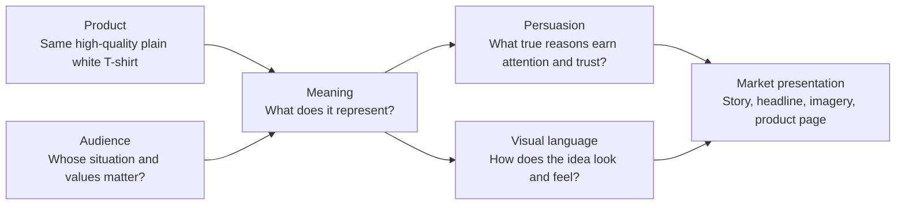

# Chapter 4: One White T-Shirt, Four Different Stories

Meet the product that refuses to change: an imaginary, ordinary, high-quality plain white T-shirt. It has the same fabric, construction, fit range, care instructions, and price in every concept below. No secret performance fabric appears halfway through the chapter. No version is objectively more fashionable. Only the presentation changes.

That makes this a useful design experiment. A product is not just its physical object; it also arrives with a story, a visual world, and an invitation about who the buyer might be. The responsible designer’s job is to make that invitation interesting *and* keep it connected to reality.

## Ground rule: the shirt stays the same

Each presentation can emphasize a different honest benefit, such as easy layering, straightforward care, or a versatile plain surface. It cannot promise a benefit the shirt does not have. A dramatic photograph can create a mood; it cannot turn the shirt into hiking equipment, luxury tailoring, or a solution to loneliness.

## Concept 1: Trailhead — the Explorer’s essential

**Headline:** *Leave room in your bag for the unexpected.*

This version is for people who like a change of scenery: students taking a day trip, new residents learning a city, or anyone who would rather say “let’s go” than spend an hour choosing an outfit. It does not claim that the shirt is technical outdoor gear. Instead, it positions the simple tee as one dependable piece in a lightly packed, flexible day.

| Element | Choice |
| --- | --- |
| Audience | Curious, independent people who value freedom and flexibility in ordinary life |
| Chosen brand archetype | **Explorer** |
| Persuasion principles | Clear product facts reduce uncertainty; a practical packing checklist offers a useful benefit before purchase; images provide gentle social proof of people using a simple wardrobe for active days |
| Visual-design language | Open space, natural light, a limited earth-and-sky palette, map-like lines, and readable type with room to breathe |
| Short product story | The T-shirt is the easy first layer for a day whose plan may change: coffee, train, walking, a gallery, dinner. It earns its place by being simple, not magical. |
| Imagery direction | A rolled shirt beside a tote bag, transit ticket, water bottle, and scuffed sneakers; candid scenes of movement rather than extreme adventure |
| Meaning invited | “I am the kind of person who can leave the routine and discover something.” |
| Ethical concern or possible misuse | Do not imply that buying a shirt makes someone adventurous, or suggest travel freedom is equally available to everyone. Do not imply outdoor performance the shirt cannot provide. |

The fun of Trailhead is that the shirt is almost the opposite of an exotic souvenir. It is the quiet thing that lets the rest of the day become interesting.

## Concept 2: Form No. 01 — the Swiss-influenced uniform

**Headline:** *One clear answer to getting dressed.*

Form No. 01 is for people who want fewer visual decisions and more useful information. The shirt is presented as a small system: white, plain, easy to combine, and described without dramatic promises. This is the restrained modernist / Swiss-influenced concept.

| Element | Choice |
| --- | --- |
| Audience | Students and working adults who value order, legibility, and an uncomplicated daily routine |
| Chosen brand archetype | **Sage**, supported by **Everyperson** |
| Persuasion principles | Specific fabric, fit, care, price, and size information support careful decision-making; clear comparisons and an easy return path support trust |
| Visual-design language | A strict grid, asymmetric but balanced layout, sans-serif type, black text on white, one practical accent color, generous spacing, and direct product photographs |
| Short product story | A reliable wardrobe needs a dependable starting point. This shirt is not introduced as a life-changing object; it is introduced as one well-explained piece that makes combinations easier. |
| Imagery direction | Front, back, and detail views on a neutral background; a simple capsule-wardrobe diagram showing the tee with familiar clothing items |
| Meaning invited | “I am organized enough to choose less and use it well.” |
| Ethical concern or possible misuse | Minimal language can hide important details if it becomes too sparse. The page still needs clear pricing, sizing, fiber content, care information, and accessible text. |

This concept lets the shirt feel calm and competent. The grid is doing real work: it helps a shopper compare details instead of hunt for them.

## Concept 3: WHITE! — the postmodern remix

**Headline:** *A blank shirt with loud opinions.*

WHITE! begins with a small joke: calling the most basic item in the room “loud.” It is for people who enjoy styling, remixing, and treating ordinary objects as raw material. The shirt remains plain, but the presentation refuses to behave like a plain product page.

| Element | Choice |
| --- | --- |
| Audience | Style experimenters, makers, and people drawn to playful visual culture |
| Chosen brand archetype | **Creator**, supported by **Jester** |
| Persuasion principles | A customization guide offers practical help; images show several styling possibilities; a prompt such as “show us your version” invites participation without pretending everyone agrees |
| Visual-design language | Disruptive postmodern composition: overlapping images, oversized type, clashing but readable color blocks, mixed type scales, visual quotation, and intentional anti-grid moments |
| Short product story | The shirt is the beginning of the outfit, not the end. Paint it, layer it, knot it, photograph it, or leave it untouched. The point is that a basic object can become a personal decision. |
| Imagery direction | Collage-like crops of the same tee styled four ways; handwritten notes, fabric-paint marks, and a deliberately visible cut-and-paste feeling |
| Meaning invited | “I can turn something ordinary into evidence of my own point of view.” |
| Ethical concern or possible misuse | Visual disruption must not make purchase details unusable. Avoid borrowing cultural symbols as decoration without context or permission, and do not pressure customers to share personal images. |

WHITE! should be playful, not confusing. If the size selector is hidden behind a spinning graphic, the joke has stopped helping.

## Concept 4: The Good Neighbor Tee — everyday care

**Headline:** *Comfort for the day you actually have.*

The Good Neighbor Tee speaks to people whose days include work, errands, study, family responsibilities, and rest. It does not promise to solve those demands. It frames a soft, simple garment as a small form of readiness and self-care: one less uncomfortable thing to manage.

| Element | Choice |
| --- | --- |
| Audience | People seeking comfort, practical ease, and a welcoming everyday experience |
| Chosen brand archetype | **Caregiver**, supported by **Everyperson** |
| Persuasion principles | Plain-language care and fit guidance reduce uncertainty; helpful customer support and a clear return policy demonstrate care; realistic photos support trust |
| Visual-design language | Warm neutrals, readable rounded type used carefully, familiar domestic scenes, comfortable spacing, and calm visual hierarchy |
| Short product story | The shirt is for the ordinary parts of a full day: making breakfast, attending class, answering messages, meeting a friend, and finally resting. It is a dependable layer, not a reward someone has to earn. |
| Imagery direction | Diverse people at home, in a library, and on a neighborhood walk; close-ups that show fit and texture without pretending the scenes are perfect |
| Meaning invited | “I deserve practical comfort, and I can show up for everyday life.” |
| Ethical concern or possible misuse | Care language can become sentimental manipulation. Do not use images of family, health, or community to create guilt, and do not claim that a purchase itself is an act of caring for others. |

This is the least flashy concept, but that is its point. It makes an ordinary shirt feel like a quiet ally rather than a costume.

## Synthesis: four presentations, one object

| Concept | Primary audience | Archetype | Design language | Main meaning | Biggest ethical check |
| --- | --- | --- | --- | --- | --- |
| Trailhead | Curious, flexible day-trippers | Explorer | Open, spacious, outdoors-adjacent | Independence and possibility | Do not fake technical performance or sell adventure as a purchase. |
| Form No. 01 | People who want clarity and fewer decisions | Sage / Everyperson | Restrained modernist, Swiss-influenced grid | Order and confident simplicity | Minimalism must not hide needed information. |
| WHITE! | Makers and playful style experimenters | Creator / Jester | Disruptive, postmodern anti-grid collage | Personal expression and remixing | Keep essential tasks usable; avoid careless cultural borrowing. |
| The Good Neighbor Tee | People seeking practical everyday comfort | Caregiver / Everyperson | Warm, clear, welcoming | Ease and everyday dignity | Do not turn care into guilt or exaggerated emotional promises. |

The shirts do not become four different physical products. Trailhead does not gain hiking features. Form No. 01 does not become more precisely made. WHITE! does not arrive pre-customized. The Good Neighbor Tee does not fix a hard day. What changes is the lens: the audience, the cultural story, the reasons offered, and the visual language that makes those ideas visible.

## A quick test for an honest presentation

Before choosing one of these directions, ask whether the headline, images, and meaning could survive a reality check:

1. What can the shirt actually do?
2. Which feeling or identity is the presentation inviting?
3. What evidence in the product experience supports that invitation?
4. What might a hurried customer wrongly assume?
5. Can they find price, fit, care, and return information as easily as they can find the mood?

If the answer to the last question is no, the presentation may be interesting but it is not yet responsible.

## What You Should Remember

The same ordinary high-quality white T-shirt can be presented as an Explorer’s flexible layer, a modernist tool for order, a postmodern canvas for expression, or a caring everyday essential. Product, audience, meaning, persuasion, and visual language work together to create each market presentation. Good design makes that meaning vivid without inventing product benefits, hiding important details, or manipulating the customer’s identity.
