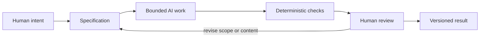

# Chapter 5: Directing AI With Meaning and Control

AI can produce words, code, layouts, images, and suggestions very quickly. Speed is useful, but speed alone does not decide whether a result is accurate, appropriate, understandable, or worth keeping. A person still needs a way to direct the work and inspect its consequences.

The three lenses from this guide provide a high-level control framework. They work for a product page, a campus event poster, a software feature, or an AI-assisted chapter of a textbook.

| Lens | Guiding question | What it controls in AI-assisted work |
| --- | --- | --- |
| Persuasion | **What response are we trying to enable?** | The desired action or understanding: learn a concept, compare choices, find a button, or review a change. |
| Archetype | **What meaning or identity are we expressing?** | The role and voice of the result: dependable guide, curious Explorer, careful Sage, playful Creator, and so on. |
| Design language | **How should that meaning look and feel?** | The visible and structural choices: plain Markdown, calm hierarchy, a strict grid, expressive type, or a dense collage. |

Together, the lenses prevent a vague instruction such as “make this better.” They make the direction discussable. For example: “Help first-year students understand the workflow, speak like a practical guide rather than a guru, and use short sections, tables, and plain Markdown.” That statement describes a response, a meaning, and a design language.

## From human intent to a versioned result

The framework needs a process around it. Human intent comes first; AI is a bounded contributor inside that process.

Each stage answers a different question:

- **Human intent:** What problem matters, who is affected, and what would success mean?
- **Specification:** What exact file, constraints, examples, and acceptance criteria define the task?
- **Bounded AI work:** Can the AI create or change only what the specification authorizes?
- **Deterministic checks:** Are the objective, repeatable requirements satisfied?
- **Human review:** Does the result make sense and deserve approval?
- **Versioned result:** Can the team see what changed, why it changed, and recover if needed?

## Why the specification must be bounded

An AI prompt is stronger when it acts like a small specification. It should say what to create, where it belongs, what it must include, and what it must not do. Bounded does not mean unfriendly or unimaginative. It means the creative work has clear edges.

Compare these requests:

| Vague request | Bounded specification |
| --- | --- |
| “Improve the textbook.” | “Create `book/03-design-language.md`. Explain modernism and postmodernism for first-year students. Include a comparison table, one valid Mermaid diagram, museum research instructions, and a final summary. Do not invent museum objects or URLs.” |

The second request makes review possible. A student can check the target file, required sections, diagram, research caution, and ending. It also reduces accidental scope expansion: the AI has not been asked to redesign the repository, edit unrelated files, or invent sources.

Specifications also help express the three lenses. A good task can state the response to enable, the meaning or tone to express, and the design language to use. For a technical task, “design language” may include code conventions, file structure, interface patterns, and documentation style—not only colors and fonts.

## Git: traceability and recovery

Git records the history of a project. A commit can show which files changed and preserve a message explaining the reason. Branches let work on an issue happen separately before it is merged. Together, these practices create **traceability**: a team can connect an outcome to a task, a decision, and a set of changes.

Traceability matters especially when AI assists with a draft or implementation. If a chapter becomes confusing or a code change introduces a problem, Git makes it possible to inspect the difference, discuss it, and recover a previous known state. It does not guarantee that every decision was good; it makes decisions visible and reversible.

A useful small workflow is:

1. Create an issue with a bounded objective.
2. Make a branch for that issue.
3. Ask AI to work within the specification.
4. Review the changed files before committing.
5. Commit with a message that refers to the issue when appropriate.
6. Run the checks, then merge only when the human reviewer accepts the result.

## Cheap checks and thoughtful review

Different kinds of checking are good at different jobs.

| Check type | Best for | Example | Limitation |
| --- | --- | --- | --- |
| Deterministic automated check | Clear rules that should give the same answer every time | Confirm required files exist, a Markdown file is nonempty, or a Mermaid block is present | It cannot decide whether an explanation is fair, useful, or culturally appropriate. |
| AI-assisted review | Fast suggestions, summaries, consistency checks, and possible omissions | Ask an AI to identify unclear headings or compare a draft to its specification | Its result is probabilistic: it can overlook problems, make mistaken suggestions, or sound confident without being right. |
| Human review | Judgment, context, truthfulness, ethics, and final approval | Decide whether a product claim is supported and whether the chapter teaches the right idea | It takes attention and cannot be reduced to a simple pass/fail script. |

Deterministic checks are valuable because they are cheap and repeatable. If a workflow requires five named chapter files, a script can check that in seconds every time. This frees human attention for questions a script cannot settle.

AI review can still be useful. It can notice a missing heading, summarize a diff, propose test cases, or point out that a claim needs evidence. But it is probabilistic: two runs may produce different comments, and a plausible comment is not automatically a correct one. Treat it as a review assistant, not as the authority that certifies reality.

## The pit-stop rule for human review

Think of an automated workflow as a race car moving through a pit lane. Machines can keep the process moving: run tests, format files, check links, and report changes. But a pit stop is a selected moment when a skilled person deliberately inspects what matters before sending the car back out.

Human review is that pit stop. Pause when the work changes meaning, affects people, makes factual claims, handles private or sensitive information, changes a public experience, or is about to be merged and released. The pause is not a sign that automation failed. It is the part of the system that protects judgment.

For this mini textbook, a human reviewer should ask: Is the explanation accurate enough for a first-year student? Did the AI invent a fact? Does the diagram really communicate the relationship? Is the tone respectful? Does the chapter meet the issue without changing unrelated work? Those questions require context and responsibility.

## The final responsibility stays human

AI can generate possibilities, but it does not take responsibility for the consequences. Humans remain responsible for:

- **Judgment:** deciding whether the result is good enough for its purpose.
- **Meaning:** deciding what the work should communicate and whose perspective it represents.
- **Truthfulness:** checking claims, examples, sources, and limits.
- **Context:** recognizing audience needs, cultural meaning, power differences, and practical constraints.
- **Final decisions:** approving, revising, rejecting, committing, or releasing the work.

This is why the three design lenses matter beyond marketing. They remind an AI user to direct more than output format. The user directs the response, the meaning, and the experience—and then reviews whether the result earned that direction.

## Questions for Next Week

1. Which part of your next AI task could be made more bounded and testable?
2. What response are you trying to enable for the person who will use your work?
3. What archetype or voice would make that response feel appropriate, and what would make it feel dishonest?
4. Which visual or technical design choices will support that meaning?
5. Which requirements can a deterministic check verify, and which require human judgment?
6. Where is your project’s next “pit stop”—the moment when someone should inspect the work before it continues?

## What You Should Remember

Persuasion, archetype, and design language form a practical framework for directing AI-assisted work: choose the response to enable, the meaning to express, and the way that meaning should look and feel. Bound the task with a specification, use Git for traceability and recovery, and use deterministic checks for repeatable requirements. AI review can help but is probabilistic. Human review is the deliberate pit stop where judgment, truthfulness, context, and final responsibility remain with people.
